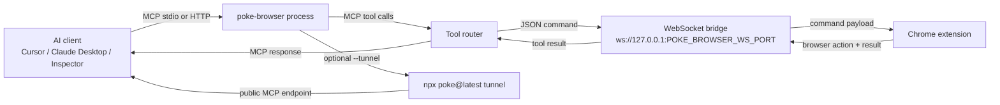

# poke-browser

Control Chrome from MCP clients with one command.

`poke-browser` runs an MCP server and bridges commands to the `poke-browser` Chrome extension over localhost WebSocket. It supports stdio MCP, HTTP MCP, and optional Poke tunnel mode for remote access.

## Fast start

Use without install:

```bash
npx poke-browser@latest
```

Or install as a dependency:

```bash
npm install poke-browser
```

## Extension setup

1. Start the launcher: `npx poke-browser@latest`
2. Open `chrome://extensions`
3. Enable Developer mode
4. Click **Load unpacked**
5. Select this repo's `extension` folder
6. Confirm the extension popup is connected

## How it works



MCP JSON-RPC stays on stdout, while operational logs are written to stderr.

## Usage

```bash
poke-browser                 # auto mode: tunnel in interactive terminals, stdio when piped
poke-browser --stdio         # force stdio MCP mode
poke-browser --http 8755     # MCP over HTTP at 127.0.0.1:8755/mcp
poke-browser --tunnel 8755   # HTTP MCP + npx poke@latest tunnel
poke-browser -n my-agent     # custom tunnel label + MCP server name
poke-browser --name my-agent # same as -n
poke-browser -y              # compatibility no-op for shared launcher contract
poke-browser --debug         # verbose logs
```

## Configuration

| Variable | Default | Description |
| --- | --- | --- |
| `POKE_BROWSER_WS_PORT` | `9009` | Extension WebSocket port |
| `POKE_BROWSER_MCP_PORT` | `8755` | HTTP MCP port (`--http` / `--tunnel`) |
| `POKE_BROWSER_PORT` | `8755` | Alias for `POKE_BROWSER_MCP_PORT` |
| `POKE_BROWSER_TUNNEL_NAME` | `poke-browser` | Label for `poke tunnel -n` |
| `POKE_BROWSER_MCP_SERVER_NAME` | `poke-browser-mcp` | MCP initialize server name |
| `POKE_BROWSER_SKIP_POKE_LOGIN` | unset | Set to `1` to skip `poke whoami/login` preflight |
| `POKE_BROWSER_YES` | unset | Set when `-y/--yes` is passed (compatibility marker) |

Keep the extension popup WebSocket target aligned with `POKE_BROWSER_WS_PORT`.

## Local development

```bash
npm install
npm run build
npm test
npm start
```

```bash
npx tsc --noEmit
npm run inspector
```

## Troubleshooting

- **No browser connected:** verify the extension is loaded and uses the same WebSocket port.
- **Port already in use:** change `POKE_BROWSER_WS_PORT` or `POKE_BROWSER_MCP_PORT`.
- **Tunnel login fails:** run `npx poke@latest login` and retry.
